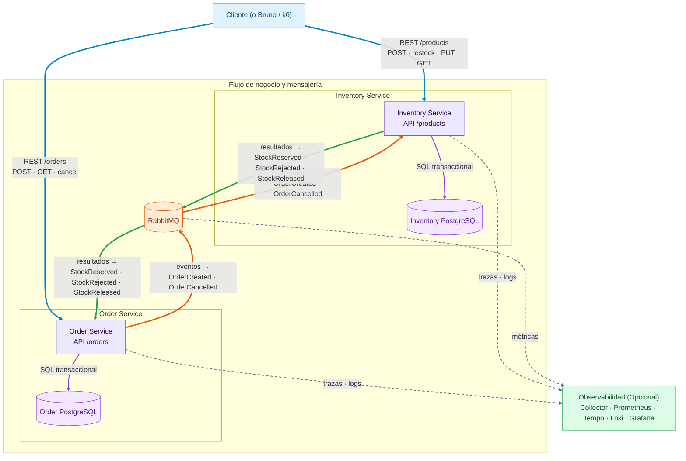

# Arquitectura del sistema

Estado: **Aceptada tras revisión final; fase IMPLEMENTACION**  
Alcance actual: primera implementación del despliegue base. El [informe de verificación](../testing/IMPLEMENTATION-VERIFICATION.md) distingue funcionalidades disponibles de extensiones pendientes.

Detalle de persistencia de la primera implementación: Inventory almacena los ítems de cada reserva como JSON en la fila del agregado, bajo el mismo lock y transacción. La tabla de detalle descrita conceptualmente no es necesaria para el acceso actual; no hay consultas cruzadas entre servicios. Cualquier evolución del esquema se realizará mediante una migración hacia adelante.

## 1. Separación entre requisitos y decisiones

### Requisitos del enunciado

- Al menos dos microservicios Spring Boot: Order Service e Inventory Service.
- Crear, consultar y cancelar pedidos; estados `PENDING`, `CONFIRMED`, `REJECTED` y `CANCELLED`.
- Cargar y consultar stock; reservar y liberar sin permitir stock negativo.
- Bases de datos o esquemas separados, sin tablas compartidas.
- Comunicación asíncrona y mensajería con semántica at-least-once.
- Escrituras idempotentes, mensajes duplicados, errores temporales, múltiples instancias y bloqueo distribuido.
- Consistencia cuando una cancelación compite con una reserva en proceso.
- Pruebas unitarias, de integración, de API y concurrentes.

### Decisiones Adicionales

- Java moderno y Spring/Spring Boot.
- Arquitectura hexagonal.
- PostgreSQL.
- Docker y Docker Compose.
- Pipeline CI/CD en GitHub.
- Diseño explícito de observabilidad, trazabilidad y reglas para agentes/TDD.

### Decisiones de alcance aceptadas

- Un pedido puede contener uno o más productos y la reserva es todo-o-nada.
- `POST /products` registra un producto con stock físico inicial.
- `POST /products/{productId}/restock` agrega unidades a un producto existente mediante un movimiento único.
- `PUT /products` fija el stock físico absoluto de un producto existente con control de versión; no suma un delta.
- Un rechazo contiene todos los ítems sin stock suficiente; no se reservan los demás.
- No hay pagos, clientes, autenticación ni despacho en el alcance inicial.
- La consistencia entre servicios es eventual; dentro de cada servicio es transaccional.
- `POST /orders` acepta el proceso con `202 PENDING`; el resultado final y los faltantes se consultan mediante `GET /orders/{orderId}`.
- El objetivo de CD inicial es producir y publicar artefactos verificables. Un despliegue a un entorno remoto requiere definir ese entorno.

## 2. Decisión principal

Se adopta un monorepo con dos aplicaciones desplegables de forma independiente y mensajería RabbitMQ. Cada servicio tiene su propia base PostgreSQL y aplica arquitectura hexagonal. La coordinación usa una Saga asíncrona, transactional outbox en productores e inbox/idempotent consumer en consumidores.

No se usa una transacción distribuida. El estado converge mediante eventos versionados y máquinas de estado que toleran duplicados y desorden.



**Leyenda de flechas:** azul = API REST; violeta = persistencia local; naranja = comandos/eventos hacia RabbitMQ; verde = resultados de Inventory hacia Order; gris discontinuo = telemetría opcional.

## 3. Stack aceptado

| Área | Elección | Motivo |
|---|---|---|
| Lenguaje | Java 26 | Versión elegida; records, sealed types y pattern matching sin características preview. No es LTS. |
| Framework | Spring Boot 4.1.1 / Spring Framework 7 | Versión exacta aceptada y compatible con Java 26. |
| Build | Maven instalado, reactor multi-módulo | Construcción reproducible mediante la versión mínima documentada y un único comando de verificación. |
| Persistencia | PostgreSQL + Flyway | Transacciones, restricciones, bloqueo de filas y advisory locks. |
| Acceso a datos | Spring Data JPA en Order; Spring JDBC/JdbcClient en Inventory y tablas técnicas | Locks y SQL explícitos en Inventory. Una conexión/transacción por caso de uso; no mezclar JPA y JDBC para modificar la misma entidad. |
| Mensajería | Spring AMQP y RabbitMQ, exchanges topic, quorum queues durables | Misma topología en local y tests, un nodo local; tres nodos solo para HA en producción. |
| API | Spring MVC, Bean Validation, RFC 9457 Problem Details | API simple, bloqueante y coherente con PostgreSQL/JPA. |
| Contratos | OpenAPI por servicio y AsyncAPI para mensajes | Contratos revisables y versionados antes de implementar. |
| Observabilidad | Actuator, Micrometer y OpenTelemetry; Prometheus, Tempo, Loki, Grafana | Métricas, trazas y logs correlacionados con estándares abiertos. |
| Pruebas | JUnit, AssertJ, Mockito, ArchUnit, Testcontainers, REST Assured, Awaitility, Bruno CLI y k6 | Cubre unidad, arquitectura, infraestructura real, aceptación y carreras. |

Referencias de versión y capacidades:

- [Requisitos de Spring Boot](https://docs.spring.io/spring-boot/system-requirements.html)
- [Confiabilidad de RabbitMQ](https://www.rabbitmq.com/docs/reliability)
- [Testcontainers en Spring Boot](https://docs.spring.io/spring-boot/reference/testing/testcontainers.html)
- [Instrumentación de Spring Boot con OpenTelemetry](https://opentelemetry.io/docs/zero-code/java/spring-boot-starter/)
- [Locks transaccionales de PostgreSQL](https://www.postgresql.org/docs/current/explicit-locking.html)
- [Seguridad del dead-lettering](https://www.rabbitmq.com/docs/dlx#safety)

Spring Boot 4.1.1 admite Java 26. Los plugins de análisis de bytecode y fuzzing deberán verificarse también con Java 26 al fijar versiones; el BOM de Boot y las versiones de imágenes/plugins quedarán fijados, sin etiquetas `latest`.

## 4. Límites de servicio

### Order Service

Es dueño de `Order` y de su ciclo de vida. Expone:

- `POST /orders`: requiere `Idempotency-Key`, crea un pedido `PENDING`, responde `202 Accepted` y una ubicación consultable.
- `GET /orders`: lista todas las órdenes conocidas por Order, incluyendo estado, líneas, faltantes y estado de cancelación de inventario.
- `GET /orders/{orderId}`: devuelve el estado actual y sus líneas; si está `REJECTED`, devuelve todos los `unavailableItems` informados por Inventory.
- `POST /orders/{orderId}/cancel`: requiere `Idempotency-Key`, acepta cancelación de `PENDING` o `CONFIRMED`, responde el estado resultante.

Responsabilidades internas:

- Validar invariantes del pedido.
- Persistir pedido y evento de salida atómicamente.
- Consumir resultados de Inventory y aplicar transiciones válidas.
- Mantener cancelación como estado terminal.
- Resolver reintentos HTTP con la misma clave sin crear otro pedido o evento.

No consulta tablas de Inventory ni bloquea su base.

### Inventory Service

Es dueño de `Product`, `Stock` y `Reservation`. Expone:

- `POST /products`: requiere `Idempotency-Key`, crea el producto con stock inicial.
- `POST /products/{productId}/restock`: requiere `Idempotency-Key`, `movementId` estable y cantidad positiva; suma unidades atómicamente una sola vez por movimiento.
- `PUT /products`: requiere `Idempotency-Key`, `productId`, `stock` absoluto y `expectedVersion`. Rechaza con `409` una versión obsoleta o un valor menor que las unidades reservadas.
- `GET /products`: lista todos los productos con `onHand`, `reserved`, `available`, `version` y la marca temporal de actualización.
- `GET /products/{productId}/stock`: devuelve `onHand`, `reserved`, `available`, `version` y la marca temporal de actualización.

Reposición y reconteo son extensiones deliberadas de los endpoints mínimos. Las tres escrituras publican sus cambios mediante outbox; los replays y no-ops no generan eventos nuevos. Se conserva `PUT /products` con producto en el body según lo solicitado; no modifica una colección ni realiza upsert. Los bodies y respuestas están en [EVENTS-AND-RACES.md](EVENTS-AND-RACES.md).

Responsabilidades internas:

- Reservar todos los ítems de un pedido o ninguno.
- Calcular bajo lock la lista completa de productos inexistentes o insuficientes antes de rechazar.
- Liberar una reserva una sola vez.
- Registrar una cancelación recibida antes de la solicitud de reserva.
- Rechazar reservas sin stock y garantizar `on_hand >= reserved >= 0` también con restricciones de base.
- Coordinar instancias concurrentes mediante locks transaccionales de PostgreSQL.

## 5. Arquitectura hexagonal por servicio

Se usará organización por capacidad, con dependencias siempre hacia el dominio:

```text
<service>/
  domain/
    model/              agregados, entidades, value objects e invariantes
    event/              eventos de dominio internos
    service/            lógica que no pertenece a una sola entidad
  application/
    port/in/            casos de uso invocables
    port/out/           persistencia, reloj, IDs y publicación
    service/            orquestación de casos de uso
  adapter/
    in/rest/            HTTP, DTO y mapeo
    in/messaging/       listeners y traducción de contratos
    out/persistence/    JPA/JDBC, entidades y mapeadores
    out/messaging/      outbox relay y RabbitMQ
    out/observability/  métricas y atributos de trazas
  configuration/        ensamblado Spring y configuración técnica
```

#### Reglas:

- `domain` es Java puro y no conoce Spring, JPA, HTTP, RabbitMQ ni JSON.
- `application` conoce el dominio y puertos; no conoce adaptadores.
- Los DTO REST, contratos AMQP y entidades JPA no se reutilizan como objetos de dominio.
- Cada microservicio se empaqueta y despliega como aplicación independiente; ninguno depende del código del otro.
- No habrá un módulo Java de modelos compartidos. Los contratos compartidos son OpenAPI/AsyncAPI, no clases de negocio.
- `shared-library` contiene únicamente infraestructura transversal sin estado de negocio: topología RabbitMQ, publisher confirms, escritura/relay de outbox, mecánica transaccional de consumidores, ejecución técnica de idempotencia HTTP, `ErrorResponse`, traducción HTTP común, codec JSON y contexto/filtro de correlación. Los servicios pueden depender de este módulo técnico; ArchUnit impide que él dependa de Order o Inventory.
- Los puertos de entrada se nombran por caso de uso (`CreateOrderUseCase`, `FindOrdersQuery`, `RestockProductUseCase`, etc.) y los de salida por capacidad requerida (`OrderStore`, `InventoryStore`, `EventPublisherPort`). Los DTO REST, comandos/read models de aplicación, dominio y entidades/representaciones de persistencia son tipos distintos y se traducen mediante mapeadores explícitos.
- Un decorador de los puertos de entrada, ensamblado en `configuration`, usa Spring TransactionTemplate para ejecutar el caso de uso. El núcleo no lleva anotaciones Spring. Inbox/idempotencia, negocio, movimientos y outbox comparten transacción local; ningún repositorio hace commits independientes.
- En Order, JpaTransactionManager y JDBC usan el mismo DataSource y conexión asociada a la transacción. En Inventory, JdbcTransactionManager coordina todo el acceso. Una prueba de rollback verifica que nunca se persista medio caso de uso.

#### Decisiones de manejo de excepciónes
Cada servicio conserva su propia `BusinessException`, limitada a fallos de negocio que requieren código estable y clasificación `NOT_FOUND` o `CONFLICT`; no contiene status HTTP ni se comparte entre bounded contexts. Las precondiciones y objetos inválidos usan `IllegalArgumentException`; estados técnicos imposibles usan `IllegalStateException`. `RequestTransactions` recibe desde la configuración de cada servicio una función de traducción, por lo que la infraestructura compartida no conoce excepciones de Order o Inventory.
- IllegalArgumentException: forma inválida de un value object/comando, cantidad fuera de rango,
  envelope o evento incompatible. En mensajería se clasifica como fallo permanente.
- IllegalStateException: ausencia de una garantía del runtime o estado persistente imposible, por
  ejemplo un producto faltante durante la liberación de una reserva ya confirmada.
- BusinessException: recurso no encontrado o conflicto de negocio que debe conservar un código
  estable para REST, idempotencia y diagnóstico, como ORDER_REJECTED o STOCK_VERSION_CONFLICT.
- Excepciones de infraestructura, como DataAccessException, no se envuelven en excepciones de
  dominio: provocan rollback/retry y se traducen en el borde HTTP cuando corresponde.

### Estructura mínima de implementación

Dos módulos Maven ejecutables, uno por servicio, y un módulo técnico no ejecutable `shared-library`; `domain`, `application`, `adapter` y `configuration` son paquetes, no cuatro módulos adicionales. ArchUnit impone sus dependencias. Un caso de uso por operación; repositorios específicos por agregado, sin repositorio CRUD genérico ni una clase por cada estado. Las transiciones se expresan en métodos del dominio y tablas de pruebas. No hace falta una biblioteca de máquinas de estados.

La transacción multítem pertenece al caso de uso de Inventory y puede coordinar varios productos; cada producto protege su cantidad y la reserva protege su ciclo de vida. El aggregate pattern no implica una transacción distribuida por producto.

Usar Spring MVC y consumidores AMQP bloqueantes con pools/prefetch acotados; los virtual threads son opcionales y no sustituyen límites de conexiones o backpressure.

### Patrones de diseño y propósito

| Patrón | Aplicación concreta |
|---|---|
| Ports and Adapters (hexagonal) | Aísla dominio y casos de uso de REST, JPA, RabbitMQ y observabilidad. |
| Aggregate y Value Object (DDD táctico) | `Order`, `Reservation`, cantidades e identificadores protegen invariantes en un solo límite transaccional. |
| Application Service | Coordina cada caso de uso sin colocar reglas de negocio en controllers/listeners. |
| Repository | Puerto de persistencia expresado en términos del dominio; JPA/JDBC queda en el adaptador. |
| Saga por coreografía | `OrderCreated`, `OrderCancelled` y resultados de Inventory hacen converger la operación sin 2PC. |
| Transactional Outbox | Evita el dual write entre PostgreSQL y RabbitMQ. |
| Inbox / Idempotent Consumer | Convierte redeliveries at-least-once en un único efecto de negocio. |
| Máquina de estados | Hace explícitas las transiciones y los eventos tardíos de Order/Reservation. |
| Idempotency Key | Da semántica de retry segura a endpoints de escritura. |
| Retry con backoff y Dead Letter Queue | Separa fallos transitorios de mensajes no procesables. |
| Lock transaccional por recurso | Serializa carreras entre réplicas sin crear un lock entre microservicios. |

No se agregarán patrones por decoración. CQRS, Event Sourcing, API Gateway y circuit breakers quedan fuera mientras no exista un problema que los justifique.

## 6. Modelo y máquinas de estado

### Order

| Estado actual | Acción/evento | Estado resultante | Efecto |
|---|---|---|---|
| inexistente | crear pedido | `PENDING` | Guardar `OrderCreated` en outbox. |
| `PENDING` | `StockReserved` | `CONFIRMED` | Guardar transición. |
| `PENDING` | `StockRejected` | `REJECTED` | Guardar motivo estable. |
| `PENDING` | cancelar | `CANCELLED` | Guardar `OrderCancelled` en outbox. |
| `CONFIRMED` | cancelar | `CANCELLED` | Guardar `OrderCancelled` en outbox. |
| `CANCELLED` | `StockReserved` o `StockRejected` tardío | `CANCELLED` | Consumir sin reabrir ni retroceder el estado de compensación. |
| `CANCELLED` | `StockReleased` | `CANCELLED` | Marcar `inventoryCancellationStatus=COMPLETED`. |
| `CANCELLED` | repetir cancelación equivalente | `CANCELLED` | Reproducir la respuesta original. |

Cancelar un `REJECTED` responde `409 Conflict` y conserva `REJECTED`.

Cancelación y resultados se serializan por fila de Order. Si `StockRejected` se aplica primero, la cancelación falla con `409`; solo una cancelación aceptada garantiza `CANCELLED`. Los pedidos confirmados conservan la reserva hasta una cancelación: no hay despacho ni consumo físico definitivo en este alcance.

La cancelación aceptada responde `202` y guarda `inventoryCancellationStatus=PENDING`; `StockReleased` lo cambia a `COMPLETED`, sin añadir estados al pedido. El GET permite diferenciar intención aceptada de compensación terminada. Repetir cancelación no crea otro evento; con la misma clave se reproduce el resultado original y con otra clave se devuelve `200` con el estado actual sin transición. Los resultados tardíos nunca hacen retroceder `COMPLETED` a `PENDING`.

### Reservation en Inventory

Estados internos definidos: `RESERVED`, `REJECTED`, `RELEASED` y `CANCELLED_BEFORE_RESERVATION`.

- `OrderCreated` crea una reserva `RESERVED` o `REJECTED`.
- Un rechazo analiza todas las líneas y publica `unavailableItems`; ninguna línea queda reservada.
- `OrderCancelled` después de `RESERVED` devuelve stock y pasa a `RELEASED`.
- `OrderCancelled` antes de `OrderCreated` crea un tombstone `CANCELLED_BEFORE_RESERVATION`.
- `OrderCancelled` después de una reserva `REJECTED` pasa a `RELEASED` sin cambiar cantidades. Puede ocurrir si Order aceptó cancelar antes de recibir el rechazo.
- Toda primera cancelación aplicada por Inventory emite `StockReleased`, incluso si no había reserva; el payload distingue `RELEASED`, `NOT_RESERVED` y `CANCELLED_BEFORE_RESERVATION`.
- Un `OrderCreated` más antiguo que el tombstone no descuenta stock.
- Repeticiones no vuelven a reservar ni liberar unidades.

Inventory conserva `lastOrderVersion` por reserva y tolera saltos: Order puede confirmar antes de cancelar, por lo que la cancelación no tiene por qué llevar versión 2. Las versiones de Order, Reservation y Product son secuencias independientes y nunca se comparan entre sí. Un resultado contiene `orderId` y `requestOrderVersion` para asociarlo con la solicitud original. Los ítems del pedido son inmutables y un `orderId` nunca se reutiliza.

## 7. Consistencia, concurrencia e idempotencia

### Escrituras HTTP

Toda escritura exige `Idempotency-Key`:

- Se persisten clave, operación/ruta, hash canónico del request, código HTTP, headers relevantes y respuesta.
- La unicidad es por servicio, operación y clave; el hash incluye identificadores de ruta y todos los campos relevantes, incluido `expectedVersion`.
- Misma clave y mismo payload reproduce la primera respuesta.
- Misma clave con payload diferente devuelve `409 Conflict`.
- Solicitudes simultáneas con la misma clave se serializan en PostgreSQL.
- Se reclama primero la clave con restricción única dentro de la transacción. Un competidor espera con timeout acotado y luego reproduce el resultado confirmado. No se usa check-then-insert sin constraint.
- No se expiran claves, movimientos, inbox ni tombstones durante la prueba. Una política de retención futura debe preservar identidades/tombstones durante todo el horizonte de replay; la limpieza no puede volver aplicable un movimiento antiguo.
- El replay se resuelve antes de revalidar stock/versiones: la respuesta original es un snapshot, no el saldo actual; para este último se usa GET. Un cambio de payload requiere una nueva clave.
- Tras reclamar una clave válida, se guardan tanto éxitos como resultados de negocio definitivos (`404`/`409`) y se confirma la respuesta sin mutación de stock si hay rechazo. Errores de formato previos a la admisión no se almacenan. Un conflicto de payload con una clave existente nunca reemplaza su respuesta. Un timeout esperando la clave/lock devuelve `503` con `Retry-After`, hace rollback y permite reintentar con la misma identidad.
- Errores transitorios hacen rollback completo; no se memoiza un `5xx` como éxito. Cantidades inválidas, claves ausentes o ítems repetidos devuelven `400`; recurso inexistente devuelve `404`; conflictos de versión, identidad o negocio devuelven `409` con Problem Details.

### Reposición frente a reconteo

| Operación | Cálculo bajo lock | Protección adicional |
|---|---|---|
| Crear | `onHand=initialStock`, `reserved=0`, `version=1` | SKU único, IDs generados por servidor |
| Reponer | `onHand=onHand+quantity`; `reserved` no cambia | `movementId` UUID único persistente en todo Inventory |
| Recontar | `onHand=stock`; `reserved` no cambia | `expectedVersion` debe coincidir con `version` bajo lock |
| Reservar | `reserved=reserved+quantity`; `onHand` no cambia | Una reserva por `orderId`, todo-o-nada |
| Liberar | `reserved=reserved-quantity`; `onHand` no cambia | Una liberación por reserva, nunca repetir |

Toda mutación de cantidades incrementa `version` del producto. No hay espera de RabbitMQ dentro del lock. Un reconteo con valor idéntico es un no-op validado y no genera movimiento/evento adicional.

Dos reposiciones distintas de +5 y +7 sobre 20 terminan en 32 sin importar qué réplica las atienda. Repetir +5 con el mismo `movementId`, incluso usando otra clave HTTP, devuelve el movimiento original y no suma. Reutilizar ese ID con producto, cantidad o razón distintos da `409`; la unicidad y el movimiento se confirman junto con stock y outbox. Una colisión concurrente que no pueda resolverse por inserción condicional provoca rollback y lectura/replay en una nueva transacción. El cliente conserva la misma identidad para una recepción física; dos IDs distintos significan dos reposiciones distintas.

Si un operador leyó 20 en versión 8 y entra una reposición que deja 25 en versión 9, su PUT con `expectedVersion=8` se rechaza. Debe consultar y reconciliar la cantidad antes de enviar una nueva clave; no reintentar automáticamente el mismo reconteo con una versión nueva. Esta protección evita borrar reposiciones legítimas con una lectura antigua. Las cantidades usan enteros positivos/cero según operación, límites explícitos y aritmética comprobada contra overflow.

### Reserva de stock

Dentro de una única transacción de Inventory:

1. Reclamar el mensaje en inbox mediante unicidad, dentro de la transacción.
2. Adquirir advisory lock transaccional por `orderId` ANTES de consultar/crear la reserva, incluso si aún no existe fila.
3. Consultar la reserva/tombstone y decidir si el evento es nuevo, repetido o anterior.
4. Para una operación nueva, bloquear productos existentes por `productId` ascendente; calcular todos los faltantes antes de modificar cantidades.
5. Incrementar `reserved` y versiones para todos o ninguno, guardar reserva/movimientos y outbox. Un rechazo de negocio se confirma con inbox y `StockRejected`, sin retry técnico.
6. Hacer commit y solo entonces ACK. Si falla, rollback también de inbox.

Se usa READ COMMITTED con locks explícitos cortos. Reposición y reconteo bloquean la misma fila de producto; nunca adquieren luego locks de pedidos. Cancelación respeta el mismo orden que reserva. El advisory lock usa una conversión estable de UUID a clave compartida por todas las réplicas, no un hash de proceso. Una colisión de hash solo serializa pedidos extra. No se borran productos en este alcance; uno ausente al consultar se informa como tal, sin afirmar que se bloqueó una fila inexistente.

PostgreSQL actúa como coordinador del lock distribuido dentro del límite de Inventory. Puede implementarse con advisory lock transaccional por `orderId` más `SELECT ... FOR UPDATE` para productos. Las restricciones `CHECK (reserved >= 0)` y `CHECK (on_hand >= reserved)` son la última barrera. No se agrega Redis: una segunda tecnología de coordinación introduciría leases y escenarios de fallo sin resolver un límite compartido entre servicios.

En Order, cancelar y aplicar un resultado de Inventory bloquean la misma fila de pedido durante una transacción corta. Así, dos réplicas no pueden aplicar transiciones incompatibles; la máquina de estados mantiene `CANCELLED` como terminal.

### Transactional outbox

Cada cambio de negocio y su mensaje se guardan en la misma base/transacción. El relay reclama un lote con `FOR UPDATE SKIP LOCKED`, asigna propietario y una lease corta y confirma esa transacción antes de hablar con el broker. Luego publica con publisher confirms y marca cada registro como publicado en otra transacción. Una lease vencida habilita otro intento. Si el proceso cae después de publicar y antes de marcar, vuelve a publicar: es intencional y lo resuelve inbox. No se mantienen locks de base mientras se espera la red.

La actualización de outbox exige el token vigente de la lease. Se publica con `mandatory=true`: un return por mensaje no enrutable, NACK o confirm incierto deja el evento pendiente. Los fallos del relay usan backoff con jitter y alertas, sin descartar eventos por agotamiento de intentos. Cada cambio lógico genera un `eventId` estable y único; se reenvía el mismo payload.

### Inbox e idempotent consumer

El consumidor inserta `(consumer_name, event_id)` con restricción única dentro de la transacción de negocio. Un duplicado se reconoce y se confirma sin repetir el efecto. Además, las invariantes y la versión del agregado protegen contra duplicados semánticos y mensajes fuera de orden con distinto `event_id`.

## 8. Mensajería

Se adoptan exchanges topic durables y una cola propia por consumidor. Los nombres finales quedarán en AsyncAPI.

Eventos mínimos:

- `OrderCreated`
- `OrderCancelled`
- `StockReserved`
- `StockRejected`
- `StockReleased`
- `ProductStockCreated`
- `ProductStockUpdated`
- `ProductStockReplenished`

Los nombres no llevan sufijo `v1`: esta es la primera versión del protocolo y `schemaVersion: 1` viaja en el envelope. `aggregateVersion` es independiente; por ejemplo, `OrderCancelled` puede representar la versión 2 del agregado sin llamarse `OrderCancelledV2`.

Envelope mínimo:

- `eventId` UUIDv7
- `eventType`, `schemaVersion`
- `aggregateId`, `aggregateVersion`
- `occurredAt`
- `correlationId`, `causationId`
- `traceparent`
- `producer`
- `payload`

Política operativa:

- Mensajes persistentes, colas durables y publisher confirms.
- ACK manual únicamente después de commit.
- Error transitorio: retry diferido con demoras crecientes y máximo de intentos.
- Error permanente o intentos agotados: DLQ con causa y metadatos originales.
- No hacer requeue inmediato indefinido.
- Los retries de procesamiento fallido técnicamente se implementan con tres colas de demora quorum, TTL fijos de 1, 5 y 30 segundos y vuelta a la cola original. En el flujo nominal: una ejecución inicial y tres reintentos diferidos; las caídas pueden repetir entregas/transferencias y no implican exactamente cuatro invocaciones. El jitter se reserva para reconexión y relay outbox.
- El consumidor hace rollback antes de transferir a retry/DLQ. Republica con mensaje persistente, headers de intento y destino original, `mandatory=true` y publisher confirm; solo después confirma el mensaje original. Una caída intermedia puede duplicar la transferencia, que conserva `eventId`.
- El salto TTL -> cola original usa dead-lettering at-least-once en las colas quorum, con política `dead-letter-strategy=at-least-once`, `overflow=reject-publish` y DLX/bindings existentes. No se depende del dead-lettering por defecto, que puede perder mensajes. Si falla la transferencia, se pausa/reconecta el consumidor y se retiene/redelivera el original sin bucle de requeue inmediato.
- El replay de DLQ conserva `eventId`; por ello sigue siendo idempotente.
- La política de delivery-limit de las colas de entrada debe definirse explícitamente con una ruta segura a DLQ mediante dead-lettering at-least-once; un límite del broker nunca debe descartar mensajes silenciosamente.
- El sistema no presupone orden global. La versión por agregado y la máquina de estados resuelven desorden.

Cada servicio tiene una cola de entrada con sus retries y DLQ. `OrderCreated`/`OrderCancelled` se enrutan a Inventory y `StockReserved`/`StockRejected`/`StockReleased` a Order. Los eventos de producto se enrutan a una cola diagnóstica durable de Inventory, consultable por herramientas de prueba; Order no mantiene un inventario paralelo. La cola diagnóstica tiene retención explícita limitada y no es el registro de auditoría: ese registro es `stock_movements` en PostgreSQL.

Compose local usa quorum queues de un solo miembro y no ofrece alta disponibilidad. En producción hacen falta tres nodos para tolerar un fallo. La convergencia requiere recuperación de las dependencias y procesamiento/replay de mensajes pendientes: un mensaje en DLQ necesita intervención y puede dejar `PENDING` o compensación pendiente. Nunca se libera stock automáticamente por timeout ni se asume un rechazo por falta de respuesta. El runbook conserva `eventId`, repara la causa, republica con confirm y verifica GET, reserva y DLQ; no edita estados manualmente en las bases.

## 9. Datos

Compose tendrá dos instancias PostgreSQL (`order-db` e `inventory-db`) con volúmenes y credenciales distintas. `order-service` e `inventory-service` también son contenedores separados. Cada aplicación solo podrá conectarse a su propia base.

Inventory conserva `on_hand` y `reserved`; `available` se deriva como `on_hand - reserved`. Reservar incrementa `reserved` y cancelar lo decrementa. Reponer suma a `on_hand` bajo lock. `PUT /products` bloquea la fila, verifica `expectedVersion` y solo aplica el nuevo `on_hand` si es al menos `reserved`. Las restricciones de base reflejan las invariantes de cantidades.

`products.version` se incrementa en reposición, reconteo, reserva y liberación. `stock_movements` registra el ID estable, operación, deltas de `onHand`/`reserved`, saldos anterior/posterior, versión y pedido/razón; los movimientos no se borran. `reservations.order_id`, SKU e identidades HTTP/inbox tienen índices únicos. Se indexa la selección de outbox por estado y próxima ejecución. No hay FK entre bases. Los ítems de Order rechazan `productId` duplicados y cantidades no positivas antes de publicar.

Tablas conceptuales de Order:

- `orders`, `order_items`
- `http_idempotency`
- `message_inbox`
- `message_outbox`

Tablas conceptuales de Inventory:

- `products`
- `reservations`, `reservation_items`
- `stock_movements`
- `http_idempotency`
- `message_inbox`
- `message_outbox`

Todos los cambios de esquema serán migraciones Flyway inmutables y hacia adelante. IDs y marcas temporales se generan de manera coherente; los timestamps se almacenan en UTC.

## 10. Despliegue con Docker Compose

Servicios base:

- `order-service`
- `inventory-service`
- `order-db`
- `inventory-db`
- `rabbitmq`

Perfil opcional `observability`:

- `otel-collector`
- `prometheus`
- `tempo`
- `loki`
- `grafana`

Otros modos de ejecución:

- `demo-data`: perfil con contenedor one-shot que espera healthchecks y carga datos mediante APIs públicas con claves idempotentes y movimientos de reposición estables.
- `constrained`: modo mediante archivo Compose de override que aplica límites bajos de CPU y memoria; un perfil por sí solo no cambia límites de servicios ya declarados.
- `chaos`: perfil para Toxiproxy y override de conexiones seleccionadas para latencia, ancho de banda limitado y cortes controlados.

La red se segmentará para que cada aplicación solo alcance su propia base. RabbitMQ será accesible por ambas. Las aplicaciones tendrán healthchecks de liveness/readiness, reintentarán conexiones al arrancar y se ejecutarán como usuario no root. Las imágenes se construirán en múltiples etapas y se configurarán únicamente mediante variables de entorno/secrets.

No se propone API Gateway, service discovery ni Config Server: no existe comunicación HTTP interna y Docker DNS cubre el despliegue solicitado.

## 11. Observabilidad y trazabilidad

La responsabilidad y justificación de cada contenedor se desarrolla en `docs/operations/OBSERVABILITY.md`.

- Trazas W3C Trace Context desde la petición HTTP, pasando por outbox y headers AMQP, hasta el consumidor.
- OpenTelemetry Java agent como opción predeterminada por su cobertura; instrumentación manual solo para spans de negocio.
- Logs JSON a stdout con `service`, `trace_id`, `span_id`, `correlation_id`, `event_id` y `order_id`. Nunca usar IDs de negocio como etiquetas de métricas.
- Métricas técnicas mediante Actuator/Micrometer y métricas de RabbitMQ/PostgreSQL.
- Métricas de negocio: pedidos por transición, resultados de reserva, duplicados descartados, reintentos, profundidad de outbox/DLQ y latencia hasta estado terminal.
- Alertas iniciales: DLQ no vacía, outbox envejecida, crecimiento de retries, error rate, latencia alta y healthcheck fallido.
- Grafana correlaciona métrica -> trace -> logs. El stack local se activa por perfil para no penalizar el arranque normal.

## 12. Seguridad y operación

- Credenciales fuera del repositorio y usuarios de base con privilegio mínimo.
- Actuator expone públicamente solo health; métricas quedan en red interna.
- Límites de tamaño y validación de requests/mensajes.
- Timeouts de DB y broker; retries solo para fallos clasificados como transitorios.
- Imágenes con base runtime mínima, usuario no root, SBOM, escaneo y procedencia del build.
- La autenticación de clientes queda fuera del alcance inicial y debe declararse en README.

## 13. Estructura objetivo del monorepo

```text
/
  AGENTS.md
  README.md
  pom.xml
  services/
    shared-library/
    order-service/
    inventory-service/
  contracts/
    openapi/
    asyncapi/
  deploy/
    compose/
    observability/
  tests/
    api/bruno/
    concurrency/k6/
    e2e/
  docs/
    architecture/
    testing/
    delivery/
    operations/
  .github/workflows/
```

## 14. Criterios arquitectónicos de aceptación

- Dos instancias de Inventory compiten por stock y nunca dejan cantidad negativa.
- Un pedido con varios faltantes se rechaza completo y devuelve la lista de todos ellos.
- Actualizar stock no permite que `onHand` quede por debajo de `reserved`.
- Reposiciones distintas se acumulan; un mismo `movementId` solo suma una vez y un reconteo obsoleto no elimina reposiciones posteriores.
- Repetir una petición HTTP con la misma clave no duplica efectos.
- Repetir cualquier evento no duplica reserva ni liberación.
- Si una cancelación aceptada y una reserva se procesan en cualquier orden, Order termina `CANCELLED/COMPLETED` y Inventory termina sin stock reservado para ese pedido.
- Caer después del commit y antes del ACK produce redelivery sin segundo efecto.
- Caer después de publicar y antes de marcar outbox produce duplicado seguro.
- Ningún servicio necesita la base o clases internas del otro.
- Una traza permite seguir request, publicación, consumo y transición final.
- Bajo CPU, memoria y red limitadas pueden aumentar latencia/reintentos, pero después de recuperar el sistema se mantienen las invariantes.
- Los fallos descubiertos por fuzzing conservan semilla, operaciones e intercalaciones relevantes para crear una regresión reproducible; la semilla sola no controla el scheduler distribuido.
- El mismo conjunto de verificaciones puede ejecutarse localmente y en GitHub Actions.

## 15. Calidad y entrega aceptadas

El ciclo obligatorio es contrato/criterio, prueba roja comprobada, implementación mínima, refactor y mismas puertas locales que CI. Se configura JUnit/ArchUnit y Testcontainers antes de implementar comportamiento; Bruno valida aceptación y k6 carga concurrente. Cada PR ejecuta un smoke multirréplica y de recursos limitados. El fuzzing extensivo (jqwik/Jazzer) y estrés/caos prolongado son opcionales; sus fallos se incorporan como regresiones obligatorias. El detalle está en [TEST-STRATEGY.md](../testing/TEST-STRATEGY.md) y las reglas de agentes en [AGENTS.md](../../AGENTS.md).

CI es prioritario. CD entrega en GHCR imágenes verificadas por digest con SBOM y procedencia, sin despliegue remoto hasta definir un entorno. [CI-CD.md](../delivery/CI-CD.md) define las puertas; [LOCAL-DEPLOYMENT.md](../operations/LOCAL-DEPLOYMENT.md) define datos de demostración repetibles y el despliegue simple. Estas decisiones quedan consolidadas aquí y en los flujos finales; no hay decisiones de arquitectura bloqueantes abiertas. La compatibilidad del conjunto de herramientas y las garantías de ejecución se comprobarán durante la implementación, no se dan por probadas por este diseño.
