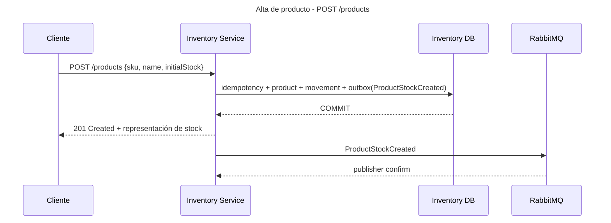
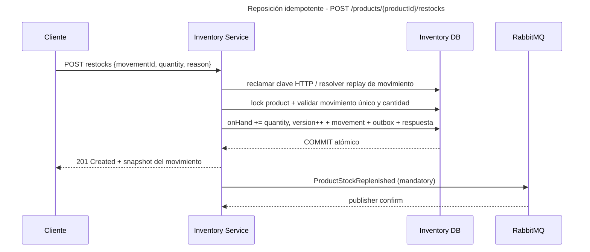
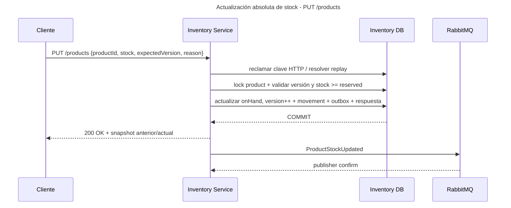
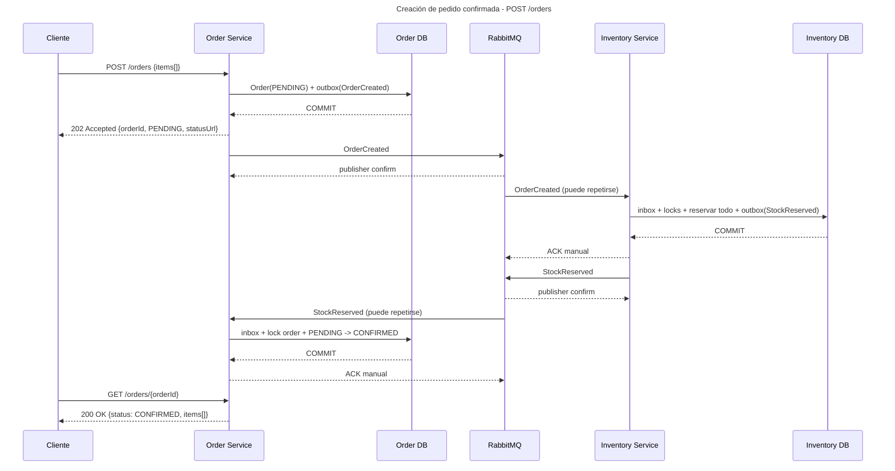
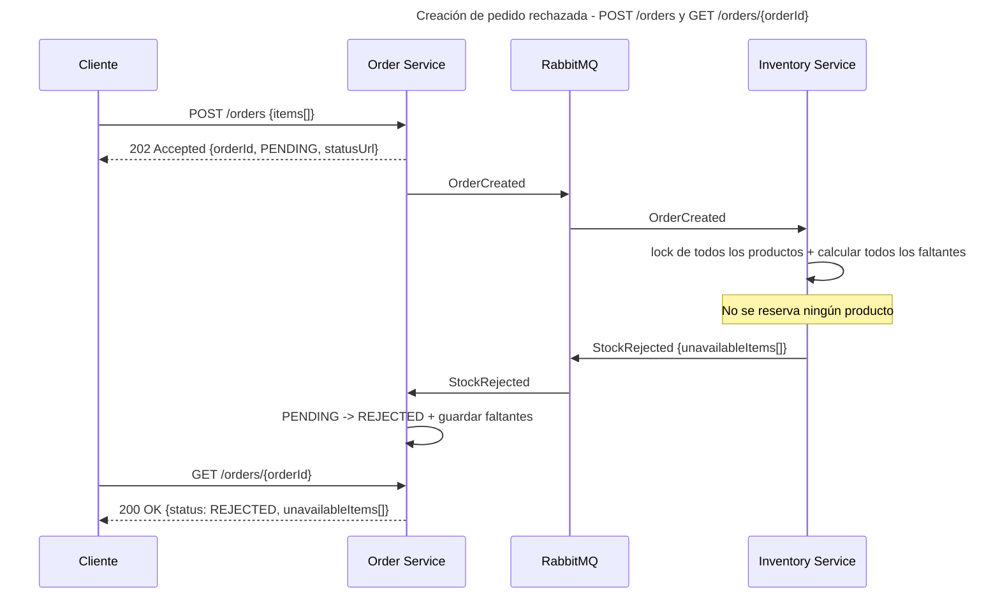
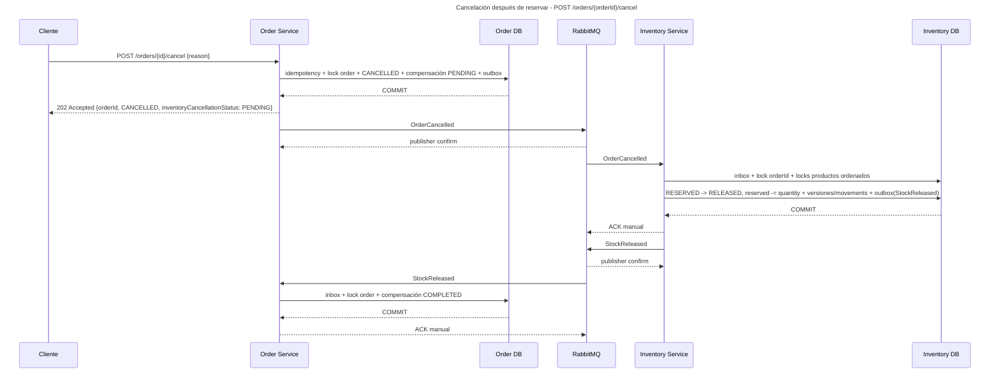

# Flujos, eventos, ACK y condiciones de carrera

Estado: **Decisiones aceptadas; contratos ilustrativos**  
Los ejemplos se convertirán en OpenAPI y AsyncAPI antes de implementar.

## Nombres y versiones

Los eventos se llaman `OrderCreated`, `OrderCancelled`, `StockReserved`, `StockRejected`, `StockReleased`, `ProductStockCreated`, `ProductStockReplenished` y `ProductStockUpdated`.
Cada envelope contiene dos versiones con propósitos distintos:

- `schemaVersion: 1`: versión del contrato del evento.
- `aggregateVersion`: secuencia monotónica del agregado productor, no una secuencia global.

Order, Reservation y Product tienen versiones independientes. Inventory guarda `lastOrderVersion` de los comandos recibidos y los resultados incluyen `requestOrderVersion`; no compara su versión de reserva con la versión de Order. Se toleran saltos de versión y los ítems de un pedido no se modifican después de crearlo.

Los IDs y `traceparent` de estos ejemplos son placeholders; los contratos exigirán UUID y contexto W3C válidos. Todos los diagramas aplican las reglas de commit, outbox, inbox y ACK del apartado de entrega, aunque se omitan pasos para facilitar la lectura. Las flechas de publicación corresponden al relay asíncrono, nunca a una llamada al broker dentro de la transacción de negocio.

Envelope conceptual:

```json
{
  "eventId": "019...",
  "eventType": "OrderCreated",
  "schemaVersion": 1,
  "aggregateId": "order-uuid",
  "aggregateVersion": 1,
  "occurredAt": "2026-09-09T15:00:00Z",
  "correlationId": "request-or-workflow-id",
  "causationId": "request-or-parent-event-id",
  "traceparent": "00-...",
  "producer": "order-service",
  "payload": {}
}
```

## Carga de producto - POST /products

Request headers: `Idempotency-Key` obligatorio.

```json
{
  "sku": "SKU-KEYBOARD-001",
  "name": "Mechanical Keyboard",
  "initialStock": 20
}
```

Respuesta `201 Created`:

```json
{
  "productId": "product-uuid",
  "sku": "SKU-KEYBOARD-001",
  "name": "Mechanical Keyboard",
  "onHand": 20,
  "reserved": 0,
  "available": 20,
  "version": 1
}
```



Los eventos de producto se enrutan a una cola diagnóstica durable de Inventory con retención limitada. No hay un consumidor de negocio de esos eventos en Order. La auditoría permanente reside en los movimientos transaccionales de Inventory, no en esa cola. La publicación debe ser enrutable y confirmada.

Payload del evento:

```json
{
  "productId": "product-uuid",
  "sku": "SKU-KEYBOARD-001",
  "onHand": 20,
  "reserved": 0,
  "available": 20
}
```

## Reposición de un producto existente - POST /products/{productId}/restocks

Suma unidades recibidas; no requiere consultar el saldo para calcular un nuevo total. Headers: `Idempotency-Key` obligatorio. El cliente genera una vez el `movementId` UUID de esta recepción y lo conserva en todos sus reintentos, incluso si cambia la clave HTTP.

```json
{
  "movementId": "movement-uuid",
  "quantity": 5,
  "reason": "SUPPLIER_DELIVERY"
}
```

Respuesta `201 Created`, suponiendo 20 unidades físicas, 4 reservadas y versión 8 antes de reponer:

```json
{
  "movementId": "movement-uuid",
  "productId": "product-uuid",
  "quantity": 5,
  "previousOnHand": 20,
  "onHand": 25,
  "reserved": 4,
  "available": 21,
  "version": 9,
  "reason": "SUPPLIER_DELIVERY"
}
```



`movementId` es único en todo Inventory, no por réplica ni por clave HTTP. Su fingerprint incluye producto, cantidad y razón. Repetir el mismo movimiento devuelve la respuesta original sin sumar ni emitir otro evento; cambiar sus datos devuelve `409`. Si compiten movimientos con la misma identidad, la restricción única decide: el perdedor hace rollback completo y resuelve replay/conflicto leyendo el movimiento confirmado. El response replay es histórico; GET devuelve el saldo actual. Dos recepciones reales distintas deben tener IDs distintos; ninguna API puede deducir que dos IDs diferentes describen la misma recepción física.

Payload de `ProductStockReplenished`: `movementId`, `productId`, `quantity`, `previousOnHand`, `onHand`, `reserved`, `available` y `reason`, como en la respuesta; `aggregateVersion: 9` va en el envelope de Product.

## Reconteo manual - PUT /products

Este endpoint extiende el mínimo del enunciado. `stock` representa el nuevo stock físico `onHand`; no es una cantidad a sumar ni hace upsert. Headers: `Idempotency-Key` obligatorio. `expectedVersion` es la versión obtenida mediante GET. El siguiente ejemplo es independiente de la reposición anterior y parte de versión 8.

```json
{
  "productId": "product-uuid",
  "stock": 30,
  "expectedVersion": 8,
  "reason": "MANUAL_RECOUNT"
}
```

Respuesta `200 OK`:

```json
{
  "productId": "product-uuid",
  "previousOnHand": 20,
  "onHand": 30,
  "reserved": 4,
  "available": 26,
  "version": 9,
  "reason": "MANUAL_RECOUNT"
}
```

Tras resolver replay, bloquea el producto y compara `expectedVersion` con la versión actual. Si difieren, responde `409 Conflict` (`STOCK_VERSION_CONFLICT`), sin cambios. Si `stock < reserved`, también responde `409` (`STOCK_BELOW_RESERVED`). Una cantidad idéntica, con versión válida, es un no-op sin nuevo movimiento/evento. Cantidades inválidas/overflow se rechazan, nunca se truncan.



Payload de `ProductStockUpdated`:

```json
{
  "productId": "product-uuid",
  "previousOnHand": 20,
  "onHand": 30,
  "reserved": 4,
  "available": 26,
  "reason": "MANUAL_RECOUNT"
}
```

`aggregateVersion: 9` identifica este snapshot. Crear, reponer, recontar, reservar y liberar incrementan la versión de Product cuando cambian cantidades. Los eventos de producto describen snapshots y pueden presentar saltos por las reservas/liberaciones; un futuro consumidor no debe descartar deltas de movimientos independientes usando solamente una marca de versión máxima.

### Reposición contra reposición y reconteo

- Sobre 20 unidades, +5 y +7 con movimientos distintos dejan 32, aunque lleguen simultáneamente a réplicas distintas.
- Repetir el movimiento +5 no vuelve a sumar, incluso con otra clave HTTP.
- Un operador lee 20/v8; una reposición deja 25/v9. Su PUT con `expectedVersion: 8` falla y no borra esas 5 unidades.
- El operador debe consultar y reconciliar el reconteo antes de usar una nueva clave/versión; no actualizar automáticamente la versión del mismo reconteo obsoleto.
- Reservas y liberaciones también invalidan una versión previamente leída. Todos estos caminos usan el mismo lock de fila del producto.
- Repetir una escritura ya confirmada con la misma clave/payload reproduce la respuesta original antes de revisar la versión, aunque el saldo haya cambiado después.

## Consulta de stock - GET /products/{productId}/stock

No tiene body. Respuesta `200 OK`:

```json
{
  "productId": "product-uuid",
  "onHand": 25,
  "reserved": 4,
  "available": 21,
  "version": 9,
  "updatedAt": "2026-09-09T15:00:00Z"
}
```

## Creación de pedido confirmada - POST /orders

Request headers: `Idempotency-Key` obligatorio.

```json
{
  "items": [
    { "productId": "product-a", "quantity": 2 },
    { "productId": "product-b", "quantity": 1 }
  ]
}
```

La aceptación es asíncrona. Respuesta inmediata `202 Accepted`:

```json
{
  "orderId": "order-uuid",
  "status": "PENDING",
  "items": [
    { "productId": "product-a", "quantity": 2 },
    { "productId": "product-b", "quantity": 1 }
  ],
  "statusUrl": "/orders/order-uuid"
}
```



## Creación de pedido rechazada - POST /orders y GET /orders/{orderId}

Inventory primero reclama inbox y toma el advisory lock por pedido; después consulta/crea Reservation y bloquea las filas existentes de productos en orden estable. Calcula todos los faltantes y no reserva ningún ítem. Un producto inexistente se informa como tal; no se puede bloquear una fila que no existe. No se borran productos en este alcance.

Payload principal de `StockRejected`:

```json
{
  "orderId": "order-uuid",
  "requestOrderVersion": 1,
  "unavailableItems": [
    {
      "productId": "product-a",
      "requested": 5,
      "available": 2,
      "reason": "INSUFFICIENT_STOCK"
    },
    {
      "productId": "product-missing",
      "requested": 1,
      "available": 0,
      "reason": "PRODUCT_NOT_FOUND"
    }
  ]
}
```



El cliente corrige los ítems y crea otro pedido con una nueva `Idempotency-Key`. El nuevo intento puede ser rechazado si otro pedido consume stock entre ambos intentos.

## Cancelación de pedido - POST /orders/{orderId}/cancel

Request headers: `Idempotency-Key` obligatorio. El body permite una razón opcional:

```json
{
  "reason": "CUSTOMER_REQUEST"
}
```

Order responde `202 Accepted` con `CANCELLED` al aceptar la transición. Cancelar un pedido `REJECTED` responde `409 Conflict` y conserva `REJECTED`.

Respuesta al aceptar:

```json
{
  "orderId": "order-uuid",
  "status": "CANCELLED",
  "inventoryCancellationStatus": "PENDING",
  "statusUrl": "/orders/order-uuid"
}
```

GET muestra `inventoryCancellationStatus: COMPLETED` cuando Order consume `StockReleased`. Este atributo distingue cancelación aceptada de compensación completada; no añade un estado de pedido. Repetir con la misma clave reproduce la respuesta histórica; otra clave en un pedido ya cancelado devuelve `200` con el estado actual, sin nuevo evento.



## Cancelación llega antes que creación

El nombre del evento permanece `OrderCancelled`; su `aggregateVersion` normalmente es mayor que la de `OrderCreated`.

1. Inventory recibe `OrderCancelled` con `aggregateVersion: 2`.
2. Bajo lock por `orderId`, crea `CANCELLED_BEFORE_RESERVATION`, registra `lastOrderVersion: 2` y outbox `StockReleased` con ese outcome, sin modificar cantidades.
3. Después recibe `OrderCreated` con `aggregateVersion: 1`.
4. Detecta que es una versión anterior y no reserva stock.
5. Los duplicados se descartan por inbox; el estado semántico también impide repetir efectos.

El resultado se confirma aunque no hubiera nada que liberar. Si Order ya estaba confirmado al cancelar, `OrderCancelled` tendrá una versión mayor (por ejemplo, 3); Inventory acepta el salto sin esperar una versión 2 que podría no haberse publicado.

## Cancelación concurrente con reserva

Ambos handlers de Inventory toman el mismo lock transaccional por `orderId`:

- Si reserva gana, incrementa `reserved`; cancelación espera, revierte exactamente esas unidades y deja `RELEASED`.
- Si cancelación gana, instala el tombstone; la reserva posterior no cambia cantidades.

Las filas de producto se adquieren por `productId` ascendente después del lock de pedido. Así se evita un ciclo de locks entre pedidos multítem.

Si Inventory rechazó por faltantes y Order todavía no consumió `StockRejected`, Order puede aceptar cancelar. Inventory convierte `REJECTED` en `RELEASED`, no altera stock y emite `StockReleased` con outcome `NOT_RESERVED`. Si Order ya aplicó `StockRejected`, cancelar responde `409`; la garantía de terminar `CANCELLED` aplica solo a cancelaciones aceptadas.

Los resultados tardíos nunca reabren `CANCELLED` ni cambian `inventoryCancellationStatus` de `COMPLETED` a `PENDING`. La ausencia temporal de respuesta no permite deducir un rechazo o liberar reservas por timeout.

## Payloads y agregado productor

| Evento | Agregado del envelope | Payload mínimo |
|---|---|---|
| `OrderCreated` | Order, `aggregateId=orderId` | `orderId`, `items[{productId,quantity}]` |
| `OrderCancelled` | Order, `aggregateId=orderId` | `orderId`, razón opcional |
| `StockReserved` | Reservation, identificada por `orderId` | `orderId`, `requestOrderVersion`, `items[{productId,quantity}]` |
| `StockRejected` | Reservation, identificada por `orderId` | `orderId`, `requestOrderVersion`, `unavailableItems[{productId,requested,available,reason}]` |
| `StockReleased` | Reservation, identificada por `orderId` | `orderId`, `requestOrderVersion`, `outcome`, `releasedItems[{productId,quantity}]` (vacío si no hubo reserva) |
| `ProductStockCreated` | Product | `productId`, `sku`, `onHand`, `reserved`, `available` |
| `ProductStockReplenished` | Product | `movementId`, `productId`, `quantity`, `previousOnHand`, `onHand`, `reserved`, `available`, `reason` |
| `ProductStockUpdated` | Product | `productId`, `previousOnHand`, `onHand`, `reserved`, `available`, `reason` |

Para `StockReleased`, los outcomes son `RELEASED`, `NOT_RESERVED` y `CANCELLED_BEFORE_RESERVATION`. `requestOrderVersion` referencia el evento Order que causó el resultado. El `aggregateVersion` de Reservation aumenta por sus propias transiciones. Order valida origen, esquema, pedido, solicitud y transición esperada; no necesita un orden global ni comparar números de agregados distintos. Un evento incompatible con ese protocolo no se aplica silenciosamente: se clasifica para DLQ/diagnóstico. Un resultado válido pero tardío se registra en inbox como ignorado.

## ACK, publisher confirm y ausencia de two-phase commit

No se usa 2PC entre PostgreSQL y RabbitMQ. ACK y publisher confirm son confirmaciones locales del protocolo AMQP, no un commit coordinado entre recursos.

### Publicación

1. La transacción de negocio guarda agregado y outbox, y hace commit en PostgreSQL.
2. El relay reclama un lote con lease en una transacción corta y publica el mismo `eventId` como mensaje persistente con `mandatory=true`, sin mantener locks durante la red.
3. RabbitMQ devuelve publisher confirm. Un return por falta de ruta, NACK o confirm incierto deja el evento pendiente.
4. El relay marca outbox como publicado solo con confirm positivo, sin return y con el token de lease vigente.
5. Si cae entre 3 y 4, vuelve a publicar el mismo evento. El consumidor lo deduplica.

### Consumo

1. RabbitMQ entrega el mensaje sin eliminarlo.
2. El consumidor abre una transacción y guarda inbox, efecto de negocio y eventual outbox.
3. Hace commit en PostgreSQL.
4. Envía ACK manual.
5. Si cae entre 3 y 4, RabbitMQ redelivera. Inbox evita el segundo efecto.

Esta combinación ofrece entrega at-least-once y efectos de negocio idempotentes, no exactly-once del transporte. La durabilidad requiere conservar las bases y colas; Compose de un nodo no es HA. Convergencia significa que las dependencias se recuperan y los mensajes pendientes se procesan: una DLQ requiere intervención y replay.

## Matriz de idempotencia

| Entrada repetida | Identidad | Protección primaria | Protección semántica |
|---|---|---|---|
| `POST /orders` | `Idempotency-Key` + operación | Restricción única y replay | Un `orderId` y un evento lógico |
| cancelar pedido | `Idempotency-Key` + operación | Restricción única | `CANCELLED` terminal |
| `POST /products` | `Idempotency-Key` + operación | Restricción única | SKU único y creación única |
| `POST /products/{id}/restocks` | Clave HTTP y `movementId` estable | Unicidad persistente del movimiento | Suma exactamente una vez por movimiento |
| `PUT /products` | `Idempotency-Key` + operación | Replay anterior a revalidación | `expectedVersion` bajo lock y `stock >= reserved` |
| mensaje AMQP | `consumer_name` + `eventId` | Inbox única | `aggregateVersion` + estado |
| publicación outbox | `eventId` estable | Consumidor idempotente | Efecto protegido por agregado |

El hash HTTP incluye IDs de ruta y payload canónico completo. Misma identidad con datos diferentes devuelve `409`. Clave, resultado, movimiento, stock y outbox se confirman juntos. No se expiran identidades HTTP, movimientos, inbox ni tombstones en este alcance. Un error técnico hace rollback, sin memoizar un `5xx` como resultado definitivo.

Con una clave válida ya admitida, los rechazos de negocio `404`/`409` también guardan su respuesta, sin cambios de stock. Un error de formato anterior a la admisión no se guarda y un conflicto de payload nunca reemplaza el registro previo. Ante timeout esperando clave/lock se devuelve `503` y `Retry-After`, con rollback y reintento seguro de la misma identidad. Un reconteo corregido tras `409` necesita nueva clave.

## Política de reintentos

| Fallo | Acción |
|---|---|
| timeout, conexión temporal, deadlock/serialization failure | rollback, transferencia confirmada a retry diferido |
| payload inválido, versión incompatible, invariante imposible | DLQ sin retry inútil |
| duplicado conocido | ACK después de verificar inbox |
| mensaje viejo pero válido | registrar como ignorado y ACK |
| intentos agotados | DLQ, métrica, log correlacionado y procedimiento de replay |

Los tiempos son TTL fijos de 1 s, 5 s y 30 s en tres colas quorum de demora: una ejecución inicial y hasta tres retries diferidos en el flujo nominal. Las caídas/redeliveries pueden repetir ejecuciones o transferencias; no es una garantía de exactamente cuatro invocaciones. El jitter se aplica a reconexiones y relay outbox, no al TTL fijo.

Tras rollback, el consumidor republica a retry o DLQ conservando `eventId`, payload, causa, contador y destino original. Espera confirm positivo y ausencia de return antes de ACK del original. Si no puede transferir, pausa/reconecta el consumidor y permite recuperar el original sin requeue inmediato infinito.

La vuelta desde TTL a la cola original usa dead-lettering **at-least-once** de quorum queues: `dead-letter-strategy=at-least-once`, `overflow=reject-publish` y DLX/bindings válidos. El dead-lettering por defecto no ofrece esa seguridad. Se verifica también la política de delivery-limit del broker y su ruta segura a DLQ para redeliveries anormales; no se deja un descarte silencioso por configuración predeterminada.

Los fallos del relay outbox se reintentan con backoff/jitter sin descartar eventos por agotamiento. El runbook de DLQ corrige la causa, republica con la identidad original y confirm, verifica la convergencia y solo entonces retira la copia original; no modifica estados de las bases. Las pruebas usan demoras mínimas/controladas y Awaitility, sin sleeps largos.
