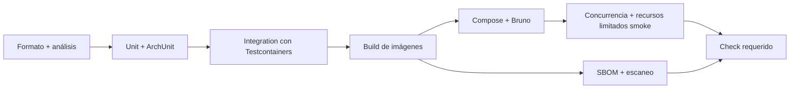

# Diseño de CI/CD en GitHub

Estado: **CI base implementado en `.github/workflows/ci.yaml`; CD y puertas adicionales pendientes**

El workflow actual ejecuta comandos portables (`mvn`, `docker compose`): unitarios, integraciones reales, reglas hexagonales, cobertura, validación de Compose y arranque base. El formato queda sujeto a revisión manual en los cambios. No se ha ejecutado remotamente aún. Las secciones siguientes mantienen el diseño objetivo; análisis de seguridad adicionales, fuzzing y publicación en GHCR todavía no están implementados. Ver [evidencia y pendientes](../testing/IMPLEMENTATION-VERIFICATION.md).

## Principios

- La misma verificación se ejecuta localmente y en CI mediante Maven instalado y comandos portables de Docker Compose.
- CI es la prioridad: protege el ciclo TDD, contratos e invariantes de concurrencia antes de publicar artefactos.
- Los jobs tienen permisos mínimos, concurrencia cancelable y dependencias/cache reproducibles.
- Las acciones de terceros se fijan por SHA; Renovate o Dependabot proponen actualizaciones.
- Ningún job de despliegue ignora una puerta fallida.

## Pull request: integración continua

Jobs propuestos:

1. `static-checks`: Maven Enforcer, análisis y contratos; el formato se revisa manualmente.
2. `unit`: unit tests, ArchUnit y reporte de cobertura.
3. `integration`: PostgreSQL y RabbitMQ reales mediante Testcontainers, incluidas carreras y ventanas de fallo deterministas de outbox/inbox y retry.
4. `container`: construir ambas imágenes sin publicar y escanearlas.
5. `e2e`: Docker Compose, healthchecks y Bruno CLI.
6. `concurrency-smoke`: múltiples réplicas, k6 corto y smoke con cuotas efectivas de recursos e interrupción recuperable de red; verifica convergencia e invariantes finales.
7. `quality-gate`: agrega resultados para protección de `main`; falla ante un job requerido fallido, cancelado u omitido. No usar filtros que omitan silenciosamente pruebas requeridas de un cambio de comportamiento.

Los property tests rápidos forman parte de `unit`. El fuzzing largo y la degradación severa de recursos no bloquean cada PR porque consumirían demasiado tiempo, pero cualquier semilla de regresión descubierta sí se agrega a la suite obligatoria.

Se guardan reportes de tests, cobertura, logs de Compose y resultados k6 solo cuando ayudan a diagnóstico. No se suben secretos ni dumps con datos sensibles.

## Workflows opcionales programados o manuales

- `fuzz-extended`: jqwik con muchas iteraciones, Jazzer para superficies puras y escenarios distribuidos con semilla.
- `resource-pressure`: override Compose `constrained`, k6 y matriz extendida de invariantes y recuperación.
- `network-chaos`: Toxiproxy y, en runner Linux apropiado, `tc/netem` para jitter/pérdida.
- `resilience`: matriz extendida de reinicios en ventanas de outbox/publisher confirm e inbox/ACK, más replay de DLQ; no sustituye los casos deterministas obligatorios de `integration`.

Una falla funcional en estas suites bloquea la promoción hasta convertirse en un caso reproducible. Los umbrales de rendimiento bajo recursos artificialmente bajos se reportan por separado de las invariantes de consistencia.

CI valida la corrección actual, pero por sí solo no demuestra que se practicó TDD: el agente registra prueba nueva roja, causa y posterior ejecución verde según `AGENTS.md`. Durante el bootstrap se crean primero los comandos locales y luego los workflows que los invocan. Las suites fallidas guardan semillas, historiales, límites efectivos y fallos inyectados, no solo resultados de k6.

## Main y releases: entrega continua secundaria

Tras el merge a `main`:

- repetir las puertas críticas;
- construir una vez cada imagen;
- etiquetar por commit SHA y publicar en GHCR;
- generar SBOM y attestation de procedencia;
- producir el bundle Compose que referencia digests inmutables;
- ejecutar un smoke test usando exactamente esos artefactos.

En un tag semántico:

- agregar tags de versión sin reconstruir artefactos distintos;
- crear release y notas;
- promover los mismos digests al entorno elegido, con GitHub Environment y aprobación si corresponde.

GitHub documenta la publicación en GHCR y las attestations de artefactos:

- [Publicar imágenes Docker](https://docs.github.com/en/actions/tutorials/publish-packages/publish-docker-images)
- [Procedencia mediante artifact attestations](https://docs.github.com/en/actions/how-tos/secure-your-work/use-artifact-attestations/use-artifact-attestations)

Sin un host objetivo, el alcance llega hasta **continuous delivery**: imágenes verificadas y publicadas en GHCR. No se configura despliegue automático a infraestructura remota.

## Mantenimiento

- CodeQL/escaneo de dependencias programado y en cambios relevantes.
- Dependabot/Renovate para Maven, Docker y GitHub Actions.
- Las pruebas extensas no reemplazan los smoke de concurrencia y resiliencia requeridos en PR.

## Protección de rama

Al crear el repositorio GitHub se configurará:

- pull request obligatorio;
- `quality-gate` requerido y actualizado con la cabeza de la rama;
- conversaciones resueltas;
- prohibición de force-push y borrado de `main`;
- revisión adicional para cambios en workflows, contratos o migraciones.
