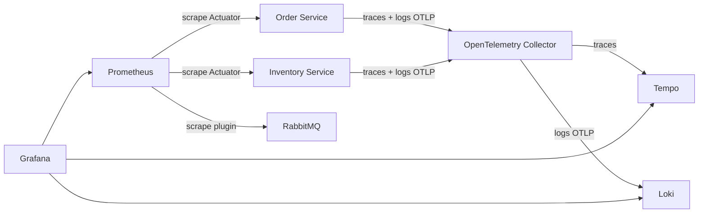

# Observabilidad y telemetría

Definición de lo necesario para perfil local opcional de observabilidad y telemetría.

## Objetivo

La observabilidad debe permitir responder cuatro preguntas sin entrar a una base manualmente:

1. ¿Qué ocurrió con un pedido desde el request hasta su estado final?
2. ¿Se perdió, duplicó, reintentó o envió a DLQ algún mensaje?
3. ¿Por qué una reserva fue rechazada o liberada?
4. ¿Qué recurso se saturó y afectó la latencia o el backlog?



## Servicios del perfil `observability`

| Servicio | Función | Justificación |
|---|---|---|
| OpenTelemetry Collector | Recibe OTLP, agrega atributos comunes, procesa/batchea y enruta telemetría. | Desacopla las aplicaciones de los backends. Cambiar Tempo/Loki no exige recompilar servicios. |
| Prometheus | Recolecta y almacena series temporales desde Actuator, RabbitMQ y el Collector. | Permite tasas, percentiles, backlog, alertas y dashboards con un estándar ampliamente soportado por Spring/Micrometer. |
| Tempo | Almacena trazas distribuidas. | Reconstruye el recorrido HTTP -> outbox -> RabbitMQ -> consumer -> cambio de estado con menor costo que indexar todos los spans como logs. |
| Loki | Centraliza logs estructurados y permite consultarlos por labels de baja cardinalidad. | Conserva el detalle de errores/retries y los correlaciona con `trace_id` sin exigir un stack de búsqueda más pesado. |
| Grafana | Interfaz unificada para métricas, trazas, logs y alertas. | Permite navegar de una métrica anómala a la traza y luego a los logs asociados. |

RabbitMQ no es parte del stack opcional: es infraestructura funcional. Su management/Prometheus plugin expone métricas al Prometheus opcional. PostgreSQL tampoco se duplica; Hikari/Micrometer cubre el pool y las operaciones de aplicación. Exporters de PostgreSQL pueden agregarse en un perfil diagnóstico si se necesitan métricas internas del motor.

Referencias:

- [OpenTelemetry para Spring Boot](https://opentelemetry.io/docs/zero-code/java/spring-boot-starter/)
- [Confiabilidad y monitoreo de RabbitMQ](https://www.rabbitmq.com/docs/reliability)

## Instrumentación de aplicaciones

- OpenTelemetry Java agent es la opción predeterminada para trazas HTTP, JDBC y RabbitMQ y para exportación de logs vía OTLP al Collector; spans manuales solo describen operaciones de negocio que la instrumentación automática no conoce. No instalar además el starter/SDK autoconfigurado para instrumentar lo mismo.
- Micrometer/Actuator expone métricas JVM, HTTP, Hikari, listeners y métricas de negocio.
- Desactivar la exportación de métricas del Java agent para no duplicar las de Micrometer. Prometheus hace scrape de Actuator, RabbitMQ y métricas internas del Collector; el Collector envía trazas a Tempo y logs OTLP a Loki. Fuera del perfil opcional, no se requieren exporters remotos para servir negocio y permanecen logs JSON a stdout.
- W3C Trace Context se recibe por HTTP, se guarda junto al registro outbox y se propaga en headers AMQP. El consumidor crea un span hijo aun cuando procese el mensaje después.
- Logs JSON van a stdout y también se correlacionan mediante `trace_id`/`span_id` cuando el perfil está activo.
- Liveness solo demuestra que el proceso vive. Readiness considera conexiones necesarias para aceptar trabajo sin prometer que toda dependencia distribuida está saludable.

## Atributos y cardinalidad

Logs/spans pueden incluir `order_id`, `product_id`, `event_id`, `correlation_id`, `causation_id`, `aggregate_version` e `idempotency_key_hash`. La clave de idempotencia original nunca se registra.

Las métricas usan labels acotados como `service`, `operation`, `event_type`, `outcome`, `exception_class` y `retry_attempt`. IDs de pedido, producto, evento o cliente no se usan como labels para evitar cardinalidad sin límite.

## Métricas de negocio y transporte

- `orders_total` (contador de órdenes creadas normalizado por Micrometer) y transiciones por estado/outcome.
- `inventory_reservations_total{outcome}` y `inventory_releases_total`.
- reposiciones por resultado, replays de movimientos y conflictos de versión en reconteos, sin IDs como labels.
- cantidad y edad de cancelaciones con `inventoryCancellationStatus=PENDING`, diferenciadas de pedidos ya terminales.
- `unavailable_items_total{reason}` sin label de producto.
- `idempotency_replays_total` y `message_duplicates_total`.
- edad y cantidad de outbox pendientes/in-flight.
- retries por intento, mensajes en DLQ y tiempo de procesamiento.
- histograma desde creación hasta estado terminal.
- HTTP latency/error rate, JVM, GC, threads/virtual threads y Hikari pool.
- profundidad de colas, unacked messages, consumers y publisher confirms de RabbitMQ.

El perfil `observability` habilita histogramas Prometheus para `http.server.requests`; el perfil
base no los habilita para mantener una exposición mínima.

## Dashboards mínimos

1. **Order lifecycle:** volumen, estados terminales, latencia y rechazos. Las series temporales
   muestran tasas (`ops/s`) para analizar actividad y comportamiento en el tiempo; el panel
   **Volumen del período** muestra cantidades absolutas acumuladas en el rango seleccionado
   mediante `increase(...)`, como pedidos creados y transiciones de estado.
2. **Inventory consistency:** reservas/liberaciones, faltantes y conflictos de actualización.
3. **Messaging:** publish/confirm, deliveries, retries, duplicados, outbox y DLQ.
4. **Runtime/resources:** CPU, memoria, GC, conexiones, HTTP y saturación.

## Alertas

- DLQ con mensajes.
- outbox más antigua que el objetivo de servicio.
- crecimiento sostenido de retries/unacked/backlog.
- ausencia de consumers o caída de publisher confirms.
- aumento de errores HTTP/consumer.
- latencia de estado terminal elevada.
- pool de conexiones agotado o readiness fallida.

Las alertas usan ventanas y duración para evitar ruido por fallos transitorios esperados.

## Operación local y pruebas limitadas

El Compose normal no inicia este stack. `--profile observability` agrega los cinco servicios. Se definen healthchecks, retención corta y límites de disco/memoria apropiados para desarrollo.

En pruebas `constrained`, el stack se mantiene apagado para no consumir el presupuesto de CPU/memoria que se desea asignar al sistema, salvo una suite específica que compruebe que la pérdida temporal del Collector no bloquea el negocio. La exportación de telemetría siempre es asíncrona y con buffers acotados.

## Ejecución reproducible

Desde el root:

```text
java scripts/Verify.java observability
```

Para inspección manual:

```text
docker compose -f compose.yaml -f deploy/compose/observability.yaml --profile observability up --build --wait --wait-timeout 180
```

El agente Java `2.10.0` se descarga en un volumen efímero del perfil y exporta trazas/logs por
OTLP; sus métricas están desactivadas para evitar duplicarlas con Micrometer. Las apps exponen
Prometheus solo con el perfil activo. Grafana se publica en `127.0.0.1:13000`, Prometheus en
`127.0.0.1:19090`, y OTLP en `127.0.0.1:4317/4318`. El perfil usa retención de seis horas,
límites de memoria de desarrollo y no modifica el Compose base.

Para generar actividad nueva durante la inspección visual, ejecutar `demo-data` con
`--periodic --interval-seconds 10 --cycles 12`; sus claves únicas evitan que los volúmenes
persistentes conviertan toda la ejecución en replay idempotente.

Los IDs de pedido, evento y correlación aparecen únicamente en logs/trazas; nunca se usan como
labels de Prometheus. Las métricas usan nombres de operación, estado, resultado, consumidor,
intento y tipo de evento, todos de cardinalidad acotada.
